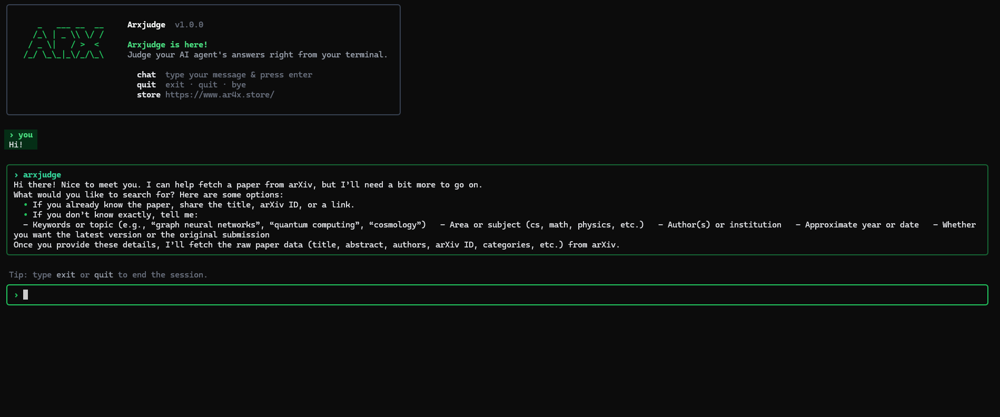
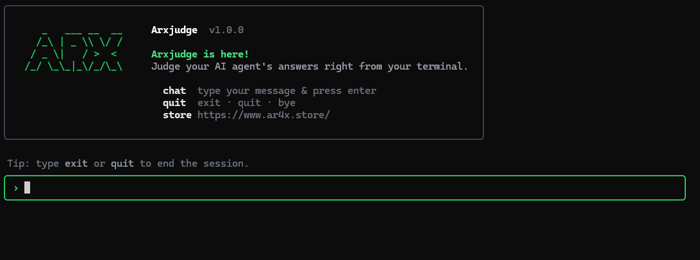

# Cliconnect

**Turn research papers into runnable code — from your terminal.**

Cliconnect is an AI-powered research assistant that helps you find papers on [arXiv](https://arxiv.org), understand their core methods, and generate a **minimal, runnable Python implementation** of the idea. Pair a web dashboard for accounts and API keys with a polished terminal chat experience.

**Store:** [ar4x.store](https://www.ar4x.store/)

## Screenshots

| CLI | UI |
|:---:|:---:|
|  |  |

---

## What it does

1. **Sign up / log in** on the web dashboard  
2. **Generate an API key** (shown once — copy and store it safely)  
3. **Authenticate the CLI** with that key  
4. **Chat in the terminal** about a paper you care about  
5. The agent fetches metadata from arXiv and **writes working Python** that demonstrates the core method  

Think of it as: *paper → conversation → code*, without leaving your workflow.

---

## Features

| Area | What you get |
|------|----------------|
| **Web dashboard** | Session-based signup/login, protected API key generation, one-time key reveal + copy |
| **CLI (`arxcli`)** | Login with API key, interactive Ink-based terminal UI, syntax-highlighted code replies |
| **AI agent** | Clarifies which paper you want, calls arXiv, then hands off to a coding agent |
| **arXiv integration** | Search by paper title/query with retries for rate limits |
| **Coding agent** | Produces short, runnable Python that implements the paper’s core idea |
| **Conversation memory** | Keeps context across turns; summarizes when the history gets long |
| **Secure keys** | API keys are SHA-256 hashed at rest; plaintext key returned only at creation |

---

## Architecture

```
┌─────────────────┐     session      ┌──────────────────┐
│  React frontend │ ───────────────► │  Express API     │
│  (Vite + TW)    │  API key gen     │  /auth/*         │
└─────────────────┘                  └────────┬─────────┘
                                              │
                                              ▼
                                     ┌──────────────────┐
                                     │  Supabase        │
                                     │  users + api_keys│
                                     └──────────────────┘

┌─────────────────┐     verify-key    ┌──────────────────┐
│  arxcli (Ink)   │ ───────────────► │  Express API     │
│  fancy.jsx chat │                  └──────────────────┘
└────────┬────────┘
         │ agent()
         ▼
┌─────────────────┐     tool call    ┌──────────────────┐
│  OpenAI agent   │ ───────────────► │  arXiv API       │
│  + coding agent │                  │  → Python code   │
└─────────────────┘                  └──────────────────┘
```

---

## Stack

- **Runtime:** Node.js (ES modules)
- **Backend:** Express, express-session, bcrypt, validator
- **Database:** Supabase (Postgres)
- **AI:** OpenAI Chat Completions + function calling
- **CLI UI:** React + [Ink](https://github.com/vadimdemedes/ink), Shiki highlighting
- **Frontend:** React, React Router, Vite, Tailwind CSS
- **External data:** arXiv Atom API

---

## Environment variables

Create a `.env` file in the project root (never commit secrets):

```env
# OpenAI
OPENAI_API_KEY=sk-...

# Supabase
SUPABASE_URL=https://your-project.supabase.co
SUPABASE_SERVICE_KEY=your-service-role-key

# Express sessions
SESSION_SECRET=a-long-random-string
```

---

## Installation

```bash
# Clone the repo
git clone https://github.com/Arvinvx/arxivagent.git
cd arxivagent

# Backend / CLI dependencies
npm install

# Frontend dependencies
cd frontend
npm install
cd ..
```

---

## Running the app

### 1. Start the API

```bash
npm start
# → http://localhost:3000
```

### 2. Start the web dashboard

```bash
cd frontend
npm run dev
# → http://localhost:5173
```

1. Open the dashboard and **sign up** or **log in**  
2. Open the protected **dashboard**  
3. Click **Generate API Key**  
4. Copy the key (`arx_…`) — it will not be shown again  

### 3. Use the CLI

From the project root (or after linking the CLI):

```bash
# Authenticate (writes ~/.arxconfig)
node cli/cli.js login

# Start the terminal chat
node cli/cli.js run
```

CLI branding in the terminal: **Arxjudge** / **arxcli**.

| Command | Description |
|---------|-------------|
| `login` | Prompt for API key, verify against the server, save to `~/.arxconfig` |
| `run` | Validate saved key and open the interactive chat |

Inside the chat:

- Type a message and press **Enter**  
- Ask for a paper by title or topic; the agent will clarify, fetch from arXiv, then generate code  
- Exit with `quit`, `exit`, or `bye`  

---

## How the AI pipeline works

```
You: "I want the Attention Is All You Need paper"
        │
        ▼
┌───────────────────┐
│  Research agent   │  Clarifies intent, then calls tool get_paper
└─────────┬─────────┘
          │
          ▼
┌───────────────────┐
│  arXiv fetch      │  Title, authors, abstract, id, PDF link
└─────────┬─────────┘
          │
          ▼
┌───────────────────┐
│  Coding agent     │  Minimal Python for the core method + tiny demo
└───────────────────┘
```

- **Research agent** (`ai/agent.js`) — conversational, tool-using; not a blind search engine  
- **Tool** (`get_paper`) — loads paper metadata via `ai/real.js`  
- **Coding agent** (`ai/coding.js`) — implements the method; comments assumptions when details are thin  
- **Memory** (`ai/memmory.js`) — retains turns; compresses history after ~10 messages  

---

## Project structure

```
Cliconnect/
├── server.js              # Express entry
├── package.json
├── .env                   # Local secrets (gitignored)
├── check.js               # API key verification client
├── hashkey.js             # SHA-256 helper for keys
├── fancy.jsx              # Terminal chat UI
├── auth/
│   ├── auth.js            # Router
│   └── authController.js  # Auth + key handlers
├── ai/
│   ├── agent.js           # Research agent + tools
│   ├── coding.js          # Paper → Python coding agent
│   ├── real.js            # arXiv client
│   ├── tools.js           # Function-calling schemas
│   └── memmory.js         # Conversation memory
├── cli/
│   └── cli.js             # arxcli (login / run)
├── db/
│   └── db.js              # Supabase client
└── frontend/
    ├── package.json
    └── src/
        ├── App.jsx        # Login, signup, dashboard
        ├── main.jsx
        └── index.css
```

---

## License

ISC (see `package.json`).

---

## Credits

- [arXiv](https://arxiv.org) for open research metadata  
- [OpenAI](https://openai.com) for models and tool calling  
- [Ink](https://github.com/vadimdemedes/ink) for the terminal React UI  
- [Supabase](https://supabase.com) for auth data storage  

---

<p align="center">
  <b>Cliconnect</b> — research papers, meet runnable code.<br/>
  <a href="https://www.ar4x.store/">ar4x.store</a>
</p>
